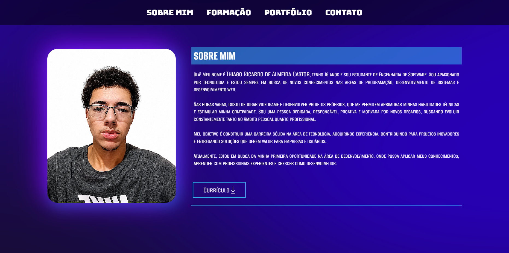

# 💼 Portfólio Pessoal

Bem-vindo ao repositório do meu portfólio!

Este projeto foi desenvolvido com o objetivo de apresentar minhas habilidades, projetos, formação acadêmica e formas de contato de maneira moderna, organizada e responsiva.

## 🚀 Tecnologias Utilizadas

- HTML5
- CSS3
- JavaScript

## ✨ Funcionalidades

- 🎨 Interface moderna
- 📱 Layout totalmente responsivo
- 🌙 Tema Claro/Escuro
- ⚡ Animações com CSS e JavaScript
- 📂 Área de projetos (Portfólio)
- 👨‍💻 Seção "Sobre Mim"
- 🎓 Formação Acadêmica
- 📧 Formulário de contato
- 🔗 Links para redes sociais

## 📷 Demonstração

> 

## 📁 Estrutura do Projeto

```text
📦 portfolio
├── docs/
├── images/
├── scripts/
├── styles/
│   ├── style.css
│   ├── responsividade.css
│   └── reset.css
├── index.html
└── README.md
```

## 🎯 Objetivo

Este projeto foi desenvolvido para colocar em prática conhecimentos em desenvolvimento web, demonstrando organização de código, boas práticas, responsividade e experiência do usuário.

## 👨‍💻 Autor

**Thiago Ricardo de Almeida Castor**

Estudante de Engenharia de Software.

## 📫 Contato

- LinkedIn
- GitHub
- E-mail

*(Os links estão disponíveis no próprio portfólio.)*

---

⭐ Se você gostou do projeto, deixe uma estrela no repositório!
